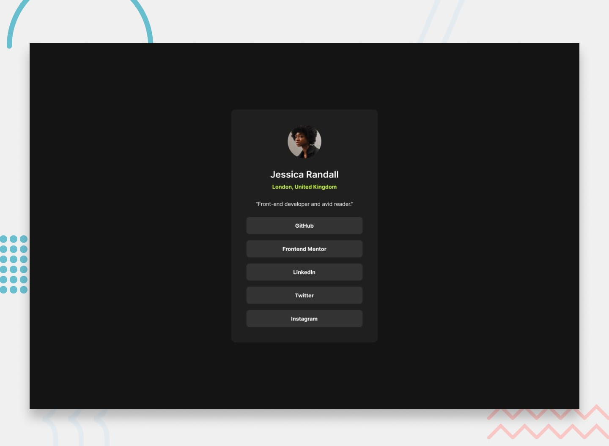

# 🔗 Social Links Profile Project



## 📌 Overview

This project is a simple yet elegant social links profile page built using only HTML and CSS. It showcases a clean, responsive design that adapts to different screen sizes using flexbox and media queries.

## 🛠️ Technologies Used

- 
- 
  - Flexbox
  - Media Queries

## ✨ Features

- 📱 Responsive design that works on mobile, tablet, and desktop screens
- 🖼️ Profile picture display
- 👤 User name and brief description
- 🔗 Multiple social media link buttons
- 🖱️ Hover effects on buttons for improved user interaction

## 🏗️ Structure

### HTML

The HTML structure includes:

```html
<main class="profile-container">
  
  <h1 class="user-name">John Doe</h1>
  <p class="user-description">Web Developer & Designer</p>
  <ul class="social-links">
    <li><a href="#" class="social-button">GitHub</a></li>
    <li><a href="#" class="social-button">LinkedIn</a></li>
    <li><a href="#" class="social-button">Twitter</a></li>
    <!-- Add more social links as needed -->
  </ul>
</main>
```

### CSS

Key CSS features:

```css
.profile-container {
  display: flex;
  flex-direction: column;
  align-items: center;
}

.social-links {
  display: flex;
  flex-direction: column;
  width: 100%;
}

@media (min-width: 768px) {
  .profile-container {
    max-width: 600px;
    margin: 0 auto;
  }
}
```

## 📐 Responsive Design

| 📱 Mobile                                    | 💻 Desktop                                     |
| -------------------------------------------- | ---------------------------------------------- |
|  |  |

## 🚀 How to Use

1. Clone the repository
   ```
   git clone https://github.com/yourusername/social-links-profile.git
   ```
2. Open the `index.html` file in a web browser
3. Customize the HTML content and CSS styles as needed

## 🔮 Future Improvements

- [ ] Add more social media platforms
- [ ] Implement dark mode toggle
- [ ] Enhance accessibility features

## 📄 License

This project is open source and available under the [MIT License](LICENSE).

---

Feel free to ⭐ this repository if you find it useful!
